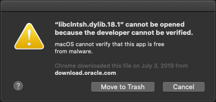

====================================
Initial Setup for Services Python
====================================

Preparing System Python Environment
====================================

Install python
    Mac:
        Macs ship with a version of python, but we don't want to touch it as it is managed by Apple
        Follow this guide_ to install python, and pip (using homebrew)
        Homebrew will install python into ``/usr/local/bin/python3``

    .. _guide: https://docs.python-guide.org/starting/installation/

After python is installed

- run: ``pip3 install --upgrade pip``
- run: ``pip3 install virtualenv virtualenvwrapper``
- run: ``mkdir ~/virtualenvs``
- update your shell:
    - if you have bash:
        - Add the following lines to your ~/.bash_profile file:
            ``VIRTUALENVWRAPPER_PYTHON=/usr/local/bin/python3.7``
            ``export WORKON_HOME=~/virtualenvs``

            And one of the following depending on your environment:

            ``source /usr/local/bin/virtualenvwrapper.sh``

            ``source /Library/Frameworks/Python.framework/Versions/3.7/bin/virtualenvwrapper.sh``

        - run: source ~/.bash_profile

    - if you have zsh
        `shell info <https://gist.github.com/heymonkeyriot/9a2f429caff5c091d5429666fa080403>`_

        1. Install the xcode standalone developer tools
            ``xcode-select -—install``

        2. Add the following lines to your ``~/.zshrc`` file:
        ::

            # Virtualenvwrapper things
            VIRTUALENVWRAPPER_PYTHON=/usr/local/bin/python3
            export WORKON_HOME=$HOME/virtualenvs
            export PROJECT_HOME=$HOME/git
            source /usr/local/bin/virtualenvwrapper.sh

        3. Restart your terminal

Create a new virtual environment
=================================

- run: ``mkvirtualenv ssp`` (you can call the environment whatever you want)
- run: ``workon ssp`` (or whatever you called it)

To deactivate the virtual environment, type ``deactivate`` in the terminal running the environment
.. TODO when does deactivation need to be done???

Install dependencies
=====================

- Make sure the virtual environment is active. (``workon ssp``)
- Within terminal, navigate to the servicesPython folder
- run: ``pip3 install -r requirements.txt``

macOS
- Download and extract the Oracle_ instant client instructions (only step #1 and #2))
where the symbolic link is created
- Open terminal and navigate to the directory where you configured the Instance Client (e.g.
``/opt/oracle/instantclient_19_3/`` and run these commands:
    - ``mkdir ~/lib``
    - ``ln -s /opt/oracle/instantclient_19_3/libclntsh.dylib ~/lib/``
    - This command will (hopefully) remove the quarantine attribute from the files:
    ``sudo xattr -w com.apple.quarantine "00c1;5d1ce8d9;Chrome;911F606C-0EBD-4B28-B709-C65D9325AB2C" *``

.. _Oracle: https://oracle.github.io/odpi/doc/installation.html#id3

Windows
- Install the Oracle Instant client following these instructions_

.. _instructions: https://oracle.github.io/odpi/doc/installation.html#id11

Configure IntelliJ
===================
- Install the Python plugin by clicking 'Preferences' > 'Plugins' and finding it in the Marketplace
- Restart IntelliJ
- Open 'File > Project Structure'
- View the 'Project' section under 'Project Settings'
- Click 'Add SDK' under the 'Project SDK' section
- Click 'Python SDK'
- Verify 'Virtualenv Environment' is selected
- Click the 'Existing environment'
- Browse your pc for the virtual environment folder that was created when you ran the command ``mkvirtualenv``
- in the ``bin`` folder find and select python3.7
- Optionally check 'Make available to all projects'
- Return to the Project Settings dialog and select the newly created environment as the Project SDK
- Download the Pipe Table Formatter_ plugin and add it to IntelliJ, when you right click on a pipe table it will add formatter functionality
    1. Open Intellij Preferences
    1. Open Plugins
    1. Click the gear to the right of the Marketplace and Installed tabs
    1. Click Install Plugin from Disk

.. _Formatter: https://plugins.jetbrains.com/plugin/7550-pipe-table-formatter

AWS Access
==========
Tests tagged with ``@aws`` require an active aws login, this uses your AWS credentials through the azure-aws-login package without needing credentials to be stored in this project
Instructions for configuring aws-azure-login can be found on `Integration Point`_
.. _Integration Point: https://ip.churchofjesuschrist.org/1925/document/aws-command-line-saml-authentication-using-aws-azure-login

To login with a gui use the following: ``aws-azure-login --mode gui``

Don't forget that this login expires after several hours (but is configurable)

Mac Security Message
=====================
When tests are run for the first time on a Mac (or after certain OS updates), security prompts may appear:

If it does, do the following to allow it:
    1. Open Preferences > Security & Privacy
    1. Naviagate to the General tab
    1. Unlock so you can make changes
    1. On the security error click Cancel
    1. Back in Security & Privacy click 'Allow Anyway'
    1. Repeat the previous two steps as needed until the security prompt has a new 'Open' button
    1. Click the Open button
    1. Repeat the 'Cancel', 'Allow...' and 'Open' steps until no longer prompted
    1. Restart the test
.. image:: mac_allow_after_security_Error.png

    If these security prompts appear again you may need to run another command, see it in 'Fixing Problems'.

Running tests from within IntelliJ
==============
- Tests can be executed by right clicking on a file, folder or scenario and selecting Run or Debug and the 'B' in the flyout menu
    .. image:: behave.png

Running tests from the command line
==============
- String exists in the filename:
    e.g. ``behave -n validation`` will run all features that have ``validation`` in the filename

- Features/Scenarios with a tag
    e.g. ``behave --tags @person_service`` will run all features that use the person service

- Exclude Features/Scenarios with a tag
    e.g. ``behave --tags ~@slow`` will run all features that are not 'slow'

- Using multiple tags, see ``behave --tags-help``

Generate a list of all steps
===============
``behave --steps-catalog``

Not committing un-necessary changes
===============
Sometimes it will be necessary to change the lane/database that is used for test, but it is not necessary to commit
this change. Occasionally when the lane/database is changed frequently it requires manual intervention to fix the
merge conflicts, which we want to eliminate as much as possible.

Please use the following to reduce these conflicts and commits of un-necessary changes.

IntelliJ contains a feature called Changelists, it allows changes to be grouped together and allows us to commit only the changes contained within that Changelist.

From an unchanged branch:
1. create a new changelist called 'don't commit' or something similar
2. change the lane and database to where you need it
3. in the git pane, move the config.py file to the new changelist

When you make other changes they will stay in the Default Changelist, including additional changes to config.py
When you commit, IntelliJ will only commit the changes in the Default Changelist (this is selectable)
The new changelist will also follow you as you switch branches

-------------------------------------

Fixing problems
===============

- If you get ``KeyError: '__len__'`` with behave
    - Check your configuration and make sure that you are using the correct Python interpreter

paths
-----

- If you run into issues with duplicate entries in your PATH variable see the following:
    - https://unix.stackexchange.com/questions/40749/remove-duplicate-path-entries-with-awk-command/149054#149054
    - Specific command run to remove duplicates: ``PATH="$(perl -e 'print join(":", grep { not $seen{$_}++ } split(/:/, $ENV{PATH}))')"``

cx_Oracle
---------

- Error : `xcrun: error: invalid active developer path (/Library/Developer/CommandLineTools), missing xcrun at: /Library/Developer/CommandLineTools/usr/bin/xcrun`
    - Solution: open xCode > Preferences > Locations and verify that 'Command Line Tools' is not blank

- Error : `Database error occurred: DPI-1047: Cannot locate a 64-bit Oracle Client library: "The specified module could not be found". See https://oracle.github.io/odpi/doc/installation.html#windows for help`
    - Solution go to above oracle website, and follow insructions.
        - FOR WINDOWS
        - Download the Oracle 11.2 VS 2005 64-bit or VS 2005 32-bit (that's the version we are currently on 7/15/2019)
        - Download 11.2 Basic Light Version 11.2.0.4.0 here https://www.oracle.com/technetwork/topics/winx64soft-089540.html
        - unzip the downloaded file and put it in this location C:\\oracle\\instantclient_18_3
        - Set the Path in your user variables within your environment Variables. THe path will be C:\\oracle\\instantclient_18_3 and click OK.

instantclient
-------------

- If you frequently get security prompts on a Mac to allow the instance client libraries try the following:
    Instructions from OracleOnTap_
    1. Navigate to the folder containing the instant client files
    2. Give the files WRITE rights ``chmod u+w *``
    3. ``cd ..``
    4. Run the following command (updating the folder name as needed):
        ``xattr -r -d -s com.apple.quarantine instantclient_19_3``

.. _OracleOnTap: http://oraontap.blogspot.com/2020/01/mac-os-x-catalina-and-oracle-instant.html